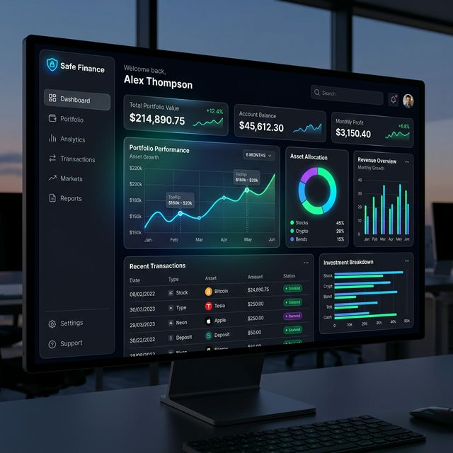

# 🛡️ Safe Finance - Premium Financial Management Ecosystem

[](https://nextjs.org/)
[](https://reactjs.org/)
[](https://tailwindcss.com/)
[](https://www.typescriptlang.org/)

**Safe Finance** is a state-of-the-art financial ecosystem designed to provide users with a secure, intuitive, and visually stunning platform for managing their assets. This repository contains both the high-converting **Landing Page** and the feature-rich **Financial Dashboard**.

---

## ✨ Project Highlights

### 🚀 [Landing Page](file:///c:/Dev/Safe-Finance/Leand-Peage-Safe-Finance)
A premium, cinematic entry point for Safe Finance users.
- **Modern UI**: Built with Radix UI and Tailwind CSS for a professional look.
- **Smooth Interaction**: Integrated with `Lenis` for premium scroll experiences.
- **Responsive Design**: Mobile-first architecture ensures a seamless experience across all devices.
- **Performance Optimized**: Leveraging Next.js 14 for lightning-fast load times.


### 📊 [Financial Dashboard](file:///c:/Dev/Safe-Finance/Dashboard-Safe-Finance)
A powerful tool for real-time financial tracking and analysis.
- **Real-time Analytics**: Interactive charts powered by `Recharts`.
- **Advanced State Management**: Efficient data handling for a responsive UX.
- **Comprehensive Backend Integration**: Integrated with AWS RDS, Prisma, and serverless databases.
- **Modern Tech Stack**: Built on the cutting-edge Next.js 16 (beta/latest) and React 19.



---

## 🛠️ Technology Stack

| Category | technologies |
| :--- | :--- |
| **Frontend** | [Next.js](https://nextjs.org/), [React 19](https://react.dev/), [TypeScript](https://www.typescriptlang.org/) |
| **Styling** | [Tailwind CSS](https://tailwindcss.com/), [Framer Motion](https://www.framer.com/motion/), [Radix UI](https://www.radix-ui.com/) |
| **Data Viz** | [Recharts](https://recharts.org/) |
| **Backend/DB** | [Prisma](https://www.prisma.io/), [AWS RDS](https://aws.amazon.com/rds/), [Vercel Postgres](https://vercel.com/docs/storage/vercel-postgres), [Neon](https://neon.tech/) |
| **Auth & Security** | [BcryptJS](https://www.npmjs.com/package/bcryptjs), [JSON Web Tokens](https://jwt.io/) |

---

## 📁 Project Structure

```bash
Safe-Finance/
├── Leand-Peage-Safe-Finance/   # 🌐 High-converting SaaS Landing Page
├── Dashboard-Safe-Finance/     # 📈 Feature-rich Financial Dashboard
└── assets/                     # 🖼️ Project documentation assets
```

---

## 🚀 Getting Started

To get the project up and running locally, follow these steps:

### 1. Clone the repository
```bash
git clone https://github.com/HenriqueMC17/Safe-Finance.git
cd Safe-Finance
```

### 2. Setup the Landing Page
```bash
cd Leand-Peage-Safe-Finance
npm install
npm run dev
```

### 3. Setup the Dashboard
```bash
cd ..
cd Dashboard-Safe-Finance
npm install
npm run dev
```

---

## 🛡️ License

This project is licensed under the MIT License.

---

<p align="center">
  Made with ❤️ by <b>HenriqueMC17</b>
</p>
